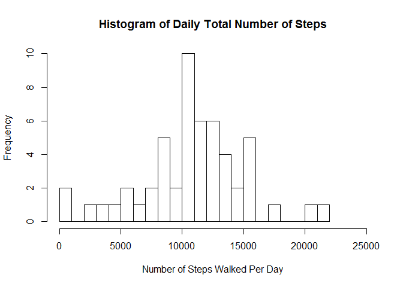
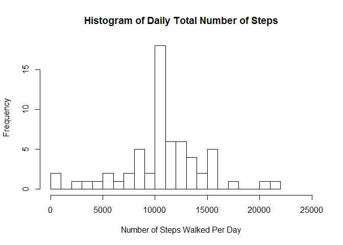
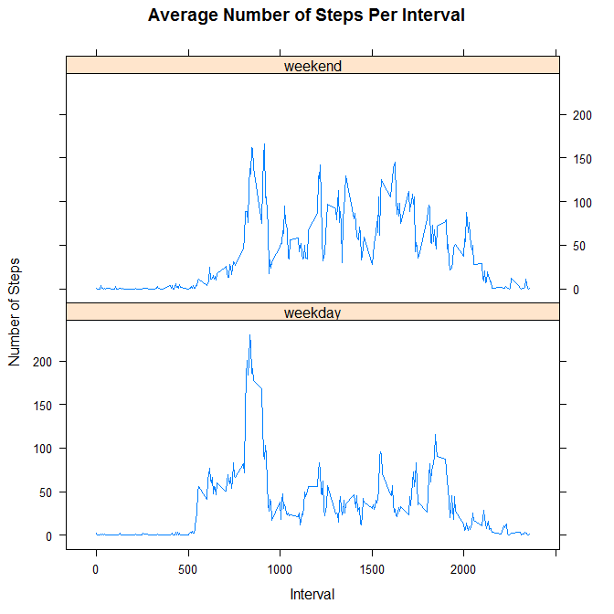

# Reproducible Research: Peer Assessment 1


## Loading and preprocessing the data

First we check to make sure that the unpacked data exists. If it does not, we unpack it from the ZIP archive (which we assume exists).


```r
if (!file.exists("./activity.csv"))
{
    unzip('activity.zip')
}
```

Next we load the data into memory.


```r
data <- read.csv('activity.csv')
```

We want to preprocess the data by grouping it by date.


```r
library(dplyr)
```

```
## 
## Attaching package: 'dplyr'
## 
## The following objects are masked from 'package:stats':
## 
##     filter, lag
## 
## The following objects are masked from 'package:base':
## 
##     intersect, setdiff, setequal, union
```

```r
data_groupDate <- group_by(data,date)
```


## What is mean total number of steps taken per day?

Count the total number of steps taken per day, and plot a histogram of daily steps


```r
dailyStepCt <- summarise(data_groupDate, sum(steps))
hist(dailyStepCt$`sum(steps)`,xlab = "Number of Steps Walked Per Day",
     main = "Histogram of Daily Total Number of Steps", breaks = 20, xlim = c(0,25000))
```

 

Then, calculate and report mean and median of the total number of steps taken per day.


```r
stepSummary <- summarise(dailyStepCt, mean(`sum(steps)`,na.rm = T), 
                         median(`sum(steps)`,na.rm = T))
meanSteps <- stepSummary[1]
medianSteps <- stepSummary[2]
options(scipen=999)   # disable scientific notation
```
  
The mean number of steps taken daily is **10766.1886792**.
The median number of steps taken daily is **10765**.

## What is the average daily activity pattern?

We group the data by intervals first, and then take an average across all days


```r
data_groupInterval <- group_by(data,interval)
intervalSummary <- summarise(data_groupInterval, mean(steps, na.rm = T),
                             median(steps, na.rm = T))
```

Then we make a time series plot of the average number of steps taken per 5 minute interval across all the days that data was measured on.


```r
plot(intervalSummary$interval, intervalSummary$`mean(steps, na.rm = T)`,type = "l",
     xlab = "Interval", ylab = "Average Number of Steps", 
     main = "Average Number of Steps per Interval")
```

 

Find the time interval that has the largest average number of steps taken.


```r
maxInterval <- intervalSummary$interval[which.max(intervalSummary$`mean(steps, na.rm = T)`)]
```
  
The interval that has the maximum average number of daily steps is **835**. 

## Imputing missing values

Tabulate the number of rows from the initial dataset that had NA steps recorded.


```r
missingRecords <- sum(is.na(data$steps))
```
  
The number of records missing step measurements is **2304**.

Replace missing step data with mean/median for that 5 minute interval in new copy of dataset.


```r
dataOrig <- data

naIndices <- which(is.na(data$steps))

for (ind in naIndices)
{
    # modulo indexing of intervalSummary, (2 = mean, 3 = median)
    data$steps[ind] <- round(intervalSummary[((ind-1) %% 288)+1,2])  
}

data$steps <- as.numeric(unlist(data$steps))
```

Repeat plotting of the histogram of the filled data and median statistics.


```r
data_groupDate <- group_by(data,date)
dailyStepCt <- summarise(data_groupDate, sum(steps))
hist(dailyStepCt$`sum(steps)`,xlab = "Number of Steps Walked Per Day",
     main = "Histogram of Daily Total Number of Steps", breaks = 20, xlim = c(0,25000))
```

 

```r
stepSummary <- summarise(dailyStepCt, mean(`sum(steps)`,na.rm = T), 
                         median(`sum(steps)`,na.rm = T))
meanSteps2 <- stepSummary[1]
medianSteps2 <- stepSummary[2]
```
  
The mean number of steps taken daily is **10765.6393443**.
The median number of steps taken daily is **10762**.

These numbers are very close to the mean and median statistics computed in earlier steps.  
By imputing missing data consisting of the mean, it moves the estimator of the population mean and the median values closer to the imputed values.

## Are there differences in activity patterns between weekdays and weekends?
 
Create a new factor variable in the dataset with two levels - "weekday" and "weekend" indicating whether a given date is a weekday or weekend day 
 

```r
data$weekend <- as.factor(weekdays(as.Date(data$date))  %in% c("Saturday","Sunday"))
levels(data$weekend)[1] <- "weekday"
levels(data$weekend)[2] <- "weekend"
```

Make a panel plot containing a time series plot (i.e. type = "l") of the 5-minute interval (x-axis) and the average number of steps taken, averaged across all weekday days or weekend days (y-axis).


```r
data_groupIntervalDate <- group_by(data, interval, weekend)
finalSummary <- summarise(data_groupIntervalDate, mean(steps, na.rm = T))

finalSummaryDay <- finalSummary[finalSummary$weekend == "weekday",]
finalSummaryEnd <- finalSummary[finalSummary$weekend == "weekend",]

library(lattice)

xyplot(`mean(steps, na.rm = T)`~interval|weekend, finalSummary,
  	main="Average Number of Steps Per Interval", 
   ylab="Number of Steps", xlab="Interval", layout = c(1,2), type="l")
```

 
